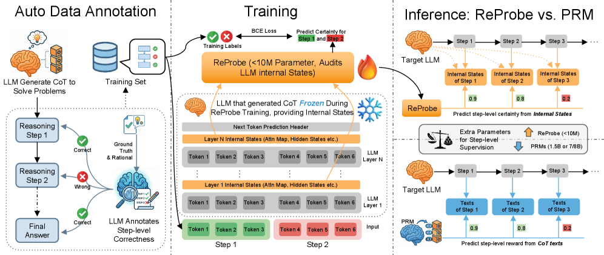
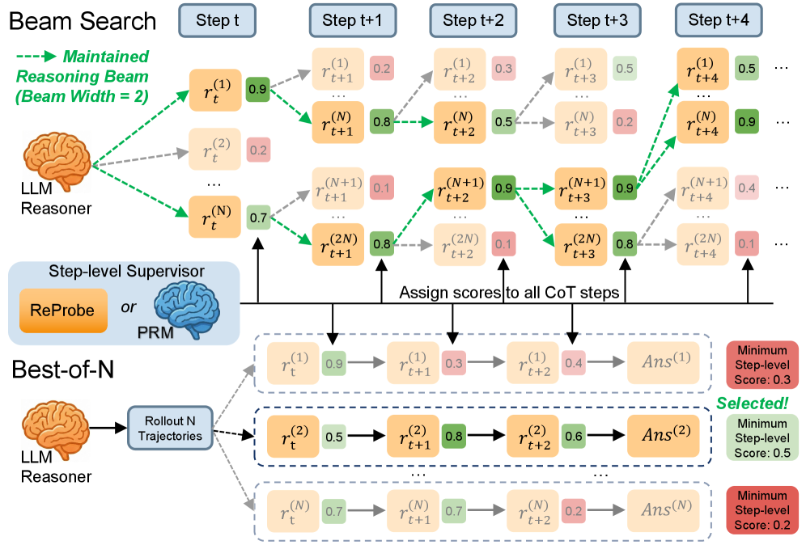
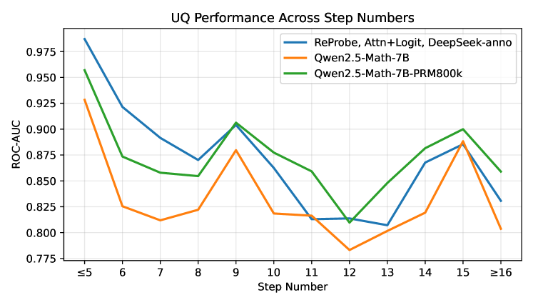

```{=html}
<!-- ============================================================
     HERO
     ============================================================ -->
<section class="hero">
  <div class="container hero-inner">

    <div class="venue-badge venue-badge-accepted">
      <i class="fa-solid fa-award"></i>&nbsp; ACL 2026 · Long Paper
    </div>

    <h1>
      Efficient Test-Time Scaling<br>
      via <span class="highlight">Probing Internal States</span><br>
      of Large Language Models
    </h1>

    <p class="hero-tagline">
      ReProbe replaces bulky Process Reward Models with a &lt;10M-parameter probe
      that reads directly from the LLM's own <strong>hidden states</strong> — achieving comparable
      or better step-level verification at a fraction of the cost.
    </p>

    <!-- Authors -->
    <div class="authors">
      <span class="author">Jingwei Ni<sup>1</sup></span>
      <span class="author">Ekaterina Fadeeva<sup>1</sup></span>
      <span class="author">Tianyi Wu<sup>1</sup></span>
      <span class="author">Mubashara Akhtar<sup>3</sup></span>
      <span class="author">Jiaheng Zhang<sup>2</sup></span>
      <span class="author">Elliott Ash<sup>1</sup></span>
      <span class="author">Markus Leippold<sup>4</sup></span>
      <span class="author">Timothy Baldwin<sup>3</sup></span>
      <span class="author">See-Kiong Ng<sup>2</sup></span>
      <span class="author">Artem Shelmanov<sup>3</sup></span>
      <span class="author">Mrinmaya Sachan<sup>1</sup></span>
    </div>
    <div class="affiliations">
      <sup>1</sup> ETH Zürich &nbsp;·&nbsp;
      <sup>2</sup> National University of Singapore &nbsp;·&nbsp;
      <sup>3</sup> MBZUAI &nbsp;·&nbsp;
      <sup>4</sup> University of Zurich &nbsp;·&nbsp;
      University of Melbourne
    </div>

    <!-- Action buttons -->
    <div class="btn-group">
      <a href="https://arxiv.org/abs/2511.06209" class="btn btn-primary" target="_blank">
        <i class="fa-solid fa-file-pdf"></i> Paper
      </a>
      <a href="https://github.com/cant-access-rediska0123/uncertainty4reasoning" class="btn btn-outline" target="_blank">
        <i class="fa-brands fa-github"></i> Code
      </a>
    </div>

    <!-- Model checkpoints -->
    <div class="checkpoint-row">
      <span class="checkpoint-label"><i class="fa-solid fa-cube"></i> Model Checkpoints</span>
      <div class="checkpoint-pills">
        <a href="https://huggingface.co/JingweiNi/ReProbe_Qwen3-8B_self_anno" class="checkpoint-pill" target="_blank">
           Qwen3-8B CoT ReProbe (self-annotated)
        </a>
        <a href="https://huggingface.co/JingweiNi/ReProbe_Qwen3-8B_DeepSeek_anno" class="checkpoint-pill" target="_blank">
           Qwen3-8B CoT ReProbe (DeepSeek-R1 annotated)
        </a>
        <a href="https://huggingface.co/JingweiNi/ReProbe_Qwen3-1.7B_natural_reasoning_GPT-OSS-120B_anno" class="checkpoint-pill" target="_blank">
           Qwen3-1.7B native reasoning ReProbe (GPT-OSS-120B annotated)
        </a>
        <a href="https://huggingface.co/JingweiNi/ReProbe_Qwen3-32B_GPT-OSS-120B_anno" class="checkpoint-pill" target="_blank">
           Qwen3-32B CoT ReProbe (GPT-OSS-120B annotated)
        </a>
      </div>
      <p style="font-size:0.75rem; color:var(--muted); margin-top:8px;">Load checkpoints following the <a href="https://github.com/cant-access-rediska0123/uncertainty4reasoning">GitHub</a> guidance for the target LLMs.</p>
    </div>

    <!-- Teaser figure: Fig 1 — overview of training + inference pipeline -->
    <div class="teaser">
      
    </div>
    <p class="fig-caption">
      ReProbe training &amp; inference overview. An annotator LLM labels step correctness on CoT traces
      (left). ReProbe is trained on internal signals from the <em>frozen</em> target LLM (middle).
      At inference, the tiny probe (&lt;10M params) replaces a 1.5–8B PRM (right).
    </p>

  </div>
</section>


<!-- ============================================================
     TL;DR + ABSTRACT
     ============================================================ -->
<section class="tldr-section">
  <div class="container">

    <div class="tldr-card">
      <div class="label">TL;DR</div>
      <p>
        We train a tiny (&lt;10M param) probe on LLM-internal signals
        (hidden states, attention, logits) to verify reasoning steps,
        matching or beating PRMs that are <strong>750–810× larger</strong>,
        with better out-of-domain generalization and up to <strong>25× faster</strong> inference.
      </p>
    </div>

    <p class="abstract-text">
      Test-time scaling improves LLM reasoning by searching over multiple candidate
      trajectories, but requires a reliable step-level verifier. Existing Process Reward
      Models (PRMs) are large, expensive to train, and often fail to generalize beyond
      their training domain. <strong>ReProbe</strong> offers a lightweight alternative:
      instead of training a separate LLM-scale verifier, we attach a small probe directly
      to the frozen target LLM, extracting its hidden states as rich supervisory signals. Trained with either
      a larger annotator LLM or a self-supervised approach, ReProbe achieves competitive
      step-level correctness prediction across mathematics, planning, and question-answering
      benchmarks, while being orders of magnitude smaller and faster.
    </p>

  </div>
</section>


<!-- ============================================================
     KEY STATS
     ============================================================ -->
<section class="stats-section">
  <div class="container">
    <div class="section-label">By the numbers</div>
    <div class="section-title">Why ReProbe?</div>

    <div class="stats-grid">

      <div class="stat-card">
        <div class="stat-number">&lt;10<span class="stat-unit">M</span></div>
        <div class="stat-label">Parameters — vs. 1.5–8B for competing PRMs</div>
      </div>

      <div class="stat-card">
        <div class="stat-number">810<span class="stat-unit">×</span></div>
        <div class="stat-label">Smaller than the largest PRM it outperforms</div>
      </div>

      <div class="stat-card">
        <div class="stat-number">25<span class="stat-unit">×</span></div>
        <div class="stat-label">Faster beam search vs. state-of-the-art PRMs</div>
      </div>

      <div class="stat-card">
        <div class="stat-number">3</div>
        <div class="stat-label">Domains tested — math, planning, QA (incl. out-of-domain)</div>
      </div>

    </div>
  </div>
</section>


<!-- ============================================================
     METHOD
     ============================================================ -->
<section class="method-section">
  <div class="container">

    <div class="section-label">Approach</div>
    <div class="section-title">How ReProbe Works</div>
    <p class="section-subtitle">
      A frozen LLM's internal signals are all you need — no PRM-scale model required.
    </p>

    <!-- Pipeline steps -->
    <div class="pipeline">

      <div class="pipeline-step">
        <div class="step-icon"><i class="fa-solid fa-brain"></i></div>
        <div class="step-num">Step 1</div>
        <h4>LLM Generates</h4>
        <p>Target LLM produces multi-step chain-of-thought traces. Its weights remain <em>frozen</em> throughout.</p>
      </div>

      <div class="pipeline-step">
        <div class="step-icon"><i class="fa-solid fa-signal"></i></div>
        <div class="step-num">Step 2</div>
        <h4>Extract Hidden States</h4>
        <p>The LLM's internal hidden states are captured per token at each reasoning step boundary.</p>
      </div>

      <div class="pipeline-step">
        <div class="step-icon"><i class="fa-solid fa-microchip"></i></div>
        <div class="step-num">Step 3</div>
        <h4>Probe Predicts</h4>
        <p>A tiny transformer encoder aggregates signals and outputs a step correctness probability.</p>
      </div>

      <div class="pipeline-step">
        <div class="step-icon"><i class="fa-solid fa-trophy"></i></div>
        <div class="step-num">Step 4</div>
        <h4>Scale at Test Time</h4>
        <p>Scores guide Best-of-N selection or Beam Search to steer toward the best final answer.</p>
      </div>

    </div>

    <!-- Fig 2: Best-of-N and Beam Search illustration -->
    <div class="method-overview" style="margin-top:48px;">
      
    </div>
    <p class="fig-caption" style="text-align:center; margin-top:12px;">
      <strong>Two test-time scaling strategies.</strong>
      Best-of-N samples N complete trajectories and selects the highest-scoring one.
      Beam Search maintains the top-B partial trajectories at each step, pruning with ReProbe scores.
    </p>

    <!-- Component cards -->
    <div class="components-grid" style="margin-top:48px;">

      <div class="component-card">
        <div class="comp-icon"><i class="fa-solid fa-layer-group"></i></div>
        <h4>Hidden State Features</h4>
        <p>Internal hidden states from the frozen LLM — extracted without any modification to the base model.</p>
      </div>

      <div class="component-card">
        <div class="comp-icon"><i class="fa-solid fa-robot"></i></div>
        <h4>Self-Supervised Training</h4>
        <p>Labels come from a larger annotator LLM (DeepSeek-R1) or fully self-supervised — no human annotation needed.</p>
      </div>

      <div class="component-card">
        <div class="comp-icon"><i class="fa-solid fa-code-branch"></i></div>
        <h4>Two Search Strategies</h4>
        <p>Best-of-N picks the highest-scoring complete trajectory; Beam Search steers generation step by step.</p>
      </div>

      <div class="component-card">
        <div class="comp-icon"><i class="fa-solid fa-plug"></i></div>
        <h4>Plug-and-Play</h4>
        <p>No changes to the base LLM. ReProbe attaches as a lightweight adapter — swap models without retraining.</p>
      </div>

    </div>

  </div>
</section>


<!-- ============================================================
     RESULTS
     ============================================================ -->
<section class="results-section">
  <div class="container">

    <div class="section-label">Experiments · Step-level PR-AUC</div>
    <div class="section-title">Results at a Glance</div>
    <p class="section-subtitle">
      ReProbe (hidden states) vs. best competing PRM across three model families and three domains.
      All values are PR-AUC averaged within each domain group.
    </p>

    <!-- Legend -->
    <div class="legend" style="display:flex; gap:20px; margin-top:28px; flex-wrap:wrap;">
      <div style="display:flex; align-items:center; gap:7px; font-size:0.82rem; font-weight:600;">
        <div style="width:14px; height:14px; border-radius:3px; background:var(--brand);"></div>
        ReProbe (Hidden States)
      </div>
      <div style="display:flex; align-items:center; gap:7px; font-size:0.82rem; font-weight:500; color:var(--muted);">
        <div style="width:14px; height:14px; border-radius:3px; background:#CBD5E1;"></div>
        Best PRM baseline
      </div>
      <div style="display:flex; align-items:center; gap:7px; font-size:0.82rem; font-weight:500; color:var(--muted);">
        <div style="width:14px; height:14px; border-radius:3px; background:#E2E8F0;"></div>
        Best UQ baseline
      </div>
    </div>

    <!-- 3 model cards -->
    <div class="model-results-grid" style="margin-top:24px;">

      <!-- ── Qwen3-8B ── -->
      <div class="model-result-card">
        <div class="model-result-header">
          <div>
            <div class="model-name">Qwen3-8B</div>
            <div class="model-meta">Main · Self-annotated</div>
          </div>
          <div style="display:flex;align-items:center;gap:8px;">
            <a href="https://huggingface.co/JingweiNi/ReProbe_Qwen3-8B_self_anno" class="card-hf-link" target="_blank" title="Self-anno checkpoint">
              
            </a>
            <a href="https://huggingface.co/JingweiNi/ReProbe_Qwen3-8B_DeepSeek_anno" class="card-hf-link" target="_blank" title="DeepSeek-anno checkpoint">
              
              <span style="font-size:0.62rem;opacity:0.7;">DS</span>
            </a>
            <div class="avg-badge">Avg 0.604</div>
          </div>
        </div>
        <div class="model-result-body">

          <div class="domain-group">
            <div class="domain-label">
              <span class="domain-icon-sm">📐</span> Math
              <span class="domain-tag tag-id">ID</span>
            </div>
            <!-- MATH avg: (0.558+0.673)/2 ≈ 0.616 (using MATH+GSM8k) -->
            <div class="comparison">
              <div class="comparison-row">
                <span class="method-name">ReProbe</span>
                <div class="bar-wrap"><div class="bar" style="width:69%;"></div></div>
                <span class="val">.558</span>
              </div>
              <div class="comparison-row">
                <span class="method-name">Best PRM</span>
                <div class="bar-wrap"><div class="bar" style="width:73%; background:#CBD5E1;"></div></div>
                <span class="val">.586</span>
              </div>
              <div class="comparison-row">
                <span class="method-name">Best UQ</span>
                <div class="bar-wrap"><div class="bar" style="width:32%; background:#E2E8F0;"></div></div>
                <span class="val">.257</span>
              </div>
            </div>
          </div>

          <div class="domain-group">
            <div class="domain-label">
              <span class="domain-icon-sm">♟</span> Planning
              <span class="domain-tag tag-ood">OOD</span>
            </div>
            <!-- avg Trips+Meetings+Calendar: ReProbe=.801, PRM=.734, UQ=.556 -->
            <div class="comparison">
              <div class="comparison-row">
                <span class="method-name">ReProbe</span>
                <div class="bar-wrap"><div class="bar" style="width:100%;"></div></div>
                <span class="val">.801</span>
              </div>
              <div class="comparison-row">
                <span class="method-name">Best PRM</span>
                <div class="bar-wrap"><div class="bar" style="width:92%; background:#CBD5E1;"></div></div>
                <span class="val">.734</span>
              </div>
              <div class="comparison-row">
                <span class="method-name">Best UQ</span>
                <div class="bar-wrap"><div class="bar" style="width:70%; background:#E2E8F0;"></div></div>
                <span class="val">.556</span>
              </div>
            </div>
          </div>

          <div class="domain-group">
            <div class="domain-label">
              <span class="domain-icon-sm">💬</span> QA
              <span class="domain-tag tag-ood">OOD</span>
            </div>
            <!-- avg StrQA+SciQA: ReProbe=.467, PRM=.383, UQ=.188 -->
            <div class="comparison">
              <div class="comparison-row">
                <span class="method-name">ReProbe</span>
                <div class="bar-wrap"><div class="bar" style="width:58%;"></div></div>
                <span class="val">.467</span>
              </div>
              <div class="comparison-row">
                <span class="method-name">Best PRM</span>
                <div class="bar-wrap"><div class="bar" style="width:48%; background:#CBD5E1;"></div></div>
                <span class="val">.383</span>
              </div>
              <div class="comparison-row">
                <span class="method-name">Best UQ</span>
                <div class="bar-wrap"><div class="bar" style="width:23%; background:#E2E8F0;"></div></div>
                <span class="val">.188</span>
              </div>
            </div>
          </div>

        </div>
      </div>

      <!-- ── Qwen3-1.7B Native Thinking ── -->
      <div class="model-result-card">
        <div class="model-result-header">
          <div>
            <div class="model-name">Qwen3-1.7B</div>
            <div class="model-meta">Native Thinking · Self-annotated</div>
          </div>
          <div style="display:flex;align-items:center;gap:8px;">
            <a href="https://huggingface.co/JingweiNi/ReProbe_Qwen3-1.7B_natural_reasoning_GPT-OSS-120B_anno" class="card-hf-link" target="_blank" title="HF checkpoint">
              
            </a>
            <div class="avg-badge">Avg 0.495</div>
          </div>
        </div>
        <div class="model-result-body">

          <div class="domain-group">
            <div class="domain-label">
              <span class="domain-icon-sm">📐</span> Math
              <span class="domain-tag tag-id">ID</span>
            </div>
            <!-- MATH=.417 -->
            <div class="comparison">
              <div class="comparison-row">
                <span class="method-name">ReProbe</span>
                <div class="bar-wrap"><div class="bar" style="width:52%;"></div></div>
                <span class="val">.417</span>
              </div>
              <div class="comparison-row">
                <span class="method-name">Best PRM</span>
                <div class="bar-wrap"><div class="bar" style="width:31%; background:#CBD5E1;"></div></div>
                <span class="val">.248</span>
              </div>
            </div>
          </div>

          <div class="domain-group">
            <div class="domain-label">
              <span class="domain-icon-sm">♟</span> Planning
              <span class="domain-tag tag-ood">OOD</span>
            </div>
            <!-- avg Trips+Meetings+Calendar: ReProbe=.653, PRM=.607 -->
            <div class="comparison">
              <div class="comparison-row">
                <span class="method-name">ReProbe</span>
                <div class="bar-wrap"><div class="bar" style="width:82%;"></div></div>
                <span class="val">.653</span>
              </div>
              <div class="comparison-row">
                <span class="method-name">Best PRM</span>
                <div class="bar-wrap"><div class="bar" style="width:76%; background:#CBD5E1;"></div></div>
                <span class="val">.607</span>
              </div>
            </div>
          </div>

          <div class="domain-group">
            <div class="domain-label">
              <span class="domain-icon-sm">💬</span> QA
              <span class="domain-tag tag-ood">OOD</span>
            </div>
            <!-- avg StrQA+SciQA: ReProbe=.411, PRM=.288 -->
            <div class="comparison">
              <div class="comparison-row">
                <span class="method-name">ReProbe</span>
                <div class="bar-wrap"><div class="bar" style="width:51%;"></div></div>
                <span class="val">.411</span>
              </div>
              <div class="comparison-row">
                <span class="method-name">Best PRM</span>
                <div class="bar-wrap"><div class="bar" style="width:36%; background:#CBD5E1;"></div></div>
                <span class="val">.288</span>
              </div>
            </div>
          </div>

        </div>
      </div>

      <!-- ── Phi-4 ── -->
      <div class="model-result-card">
        <div class="model-result-header">
          <div>
            <div class="model-name">Phi-4</div>
            <div class="model-meta">DeepSeek-annotated</div>
          </div>
          <div class="avg-badge">Avg 0.497</div>
        </div>
        <div class="model-result-body">

          <div class="domain-group">
            <div class="domain-label">
              <span class="domain-icon-sm">📐</span> Math
              <span class="domain-tag tag-id">ID</span>
            </div>
            <!-- MATH=.442 -->
            <div class="comparison">
              <div class="comparison-row">
                <span class="method-name">ReProbe</span>
                <div class="bar-wrap"><div class="bar" style="width:55%;"></div></div>
                <span class="val">.442</span>
              </div>
              <div class="comparison-row">
                <span class="method-name">Best PRM</span>
                <div class="bar-wrap"><div class="bar" style="width:59%; background:#CBD5E1;"></div></div>
                <span class="val">.474</span>
              </div>
            </div>
          </div>

          <div class="domain-group">
            <div class="domain-label">
              <span class="domain-icon-sm">♟</span> Planning
              <span class="domain-tag tag-ood">OOD</span>
            </div>
            <!-- avg Trips+Meetings+Calendar: ReProbe=.686, PRM=.664 -->
            <div class="comparison">
              <div class="comparison-row">
                <span class="method-name">ReProbe</span>
                <div class="bar-wrap"><div class="bar" style="width:86%;"></div></div>
                <span class="val">.686</span>
              </div>
              <div class="comparison-row">
                <span class="method-name">Best PRM</span>
                <div class="bar-wrap"><div class="bar" style="width:83%; background:#CBD5E1;"></div></div>
                <span class="val">.664</span>
              </div>
            </div>
          </div>

          <div class="domain-group">
            <div class="domain-label">
              <span class="domain-icon-sm">💬</span> QA
              <span class="domain-tag tag-ood">OOD</span>
            </div>
            <!-- avg StrQA+SciQA: ReProbe=.393, PRM=.342 -->
            <div class="comparison">
              <div class="comparison-row">
                <span class="method-name">ReProbe</span>
                <div class="bar-wrap"><div class="bar" style="width:49%;"></div></div>
                <span class="val">.393</span>
              </div>
              <div class="comparison-row">
                <span class="method-name">Best PRM</span>
                <div class="bar-wrap"><div class="bar" style="width:43%; background:#CBD5E1;"></div></div>
                <span class="val">.342</span>
              </div>
            </div>
          </div>

        </div>
      </div>

      <!-- ── Qwen3-32B Native Thinking ── -->
      <div class="model-result-card">
        <div class="model-result-header">
          <div>
            <div class="model-name">Qwen3-32B</div>
            <div class="model-meta">Native Thinking · GPT-OSS-annotated</div>
          </div>
          <div style="display:flex;align-items:center;gap:8px;">
            <a href="https://huggingface.co/JingweiNi/ReProbe_Qwen3-32B_GPT-OSS-120B_anno" class="card-hf-link" target="_blank" title="HF checkpoint">
              
            </a>
            <div class="avg-badge">Avg 0.585</div>
          </div>
        </div>
        <div class="model-result-body">

          <div class="domain-group">
            <div class="domain-label">
              <span class="domain-icon-sm">📐</span> Math
              <span class="domain-tag tag-id">ID</span>
            </div>
            <!-- MATH=.676, PRM best (Qwen2.5-Math-PRM-7B)=.668 -->
            <div class="comparison">
              <div class="comparison-row">
                <span class="method-name">ReProbe</span>
                <div class="bar-wrap"><div class="bar" style="width:85%;"></div></div>
                <span class="val">.676</span>
              </div>
              <div class="comparison-row">
                <span class="method-name">Best PRM</span>
                <div class="bar-wrap"><div class="bar" style="width:84%; background:#CBD5E1;"></div></div>
                <span class="val">.668</span>
              </div>
            </div>
          </div>

          <div class="domain-group">
            <div class="domain-label">
              <span class="domain-icon-sm">♟</span> Planning
              <span class="domain-tag tag-ood">OOD</span>
            </div>
            <!-- avg Trips+Meetings+Calendar: ReProbe=.728, PRM=.677 -->
            <div class="comparison">
              <div class="comparison-row">
                <span class="method-name">ReProbe</span>
                <div class="bar-wrap"><div class="bar" style="width:91%;"></div></div>
                <span class="val">.728</span>
              </div>
              <div class="comparison-row">
                <span class="method-name">Best PRM</span>
                <div class="bar-wrap"><div class="bar" style="width:85%; background:#CBD5E1;"></div></div>
                <span class="val">.677</span>
              </div>
            </div>
          </div>

          <div class="domain-group">
            <div class="domain-label">
              <span class="domain-icon-sm">💬</span> QA
              <span class="domain-tag tag-ood">OOD</span>
            </div>
            <!-- avg StrQA+SciQA: ReProbe=.303, PRM=.314 -->
            <div class="comparison">
              <div class="comparison-row">
                <span class="method-name">ReProbe</span>
                <div class="bar-wrap"><div class="bar" style="width:38%;"></div></div>
                <span class="val">.303</span>
              </div>
              <div class="comparison-row">
                <span class="method-name">Best PRM</span>
                <div class="bar-wrap"><div class="bar" style="width:39%; background:#CBD5E1;"></div></div>
                <span class="val">.314</span>
              </div>
            </div>
          </div>

        </div>
      </div>

    </div><!-- /model-results-grid -->

    <p style="font-size:0.78rem; color:var(--muted); margin-top:16px; text-align:center;">
      Planning avg: Trips + Meetings + Calendar. &nbsp;QA avg: StrQA + SciQA. &nbsp;Math shown as MATH benchmark.
      Full tables in <a href="https://arxiv.org/abs/2511.06209" target="_blank">the paper</a>.
    </p>

    <!-- ── Divider ── -->
    <div style="border-top:1px solid var(--border); margin:48px 0 40px;"></div>

    <div class="section-label">Test-Time Scaling · Accuracy (%)</div>
    <div class="section-title" style="font-size:1.5rem;">Best-of-N &amp; Beam Search</div>
    <p class="section-subtitle" style="margin-bottom:28px;">
      Qwen3-8B accuracy when using ReProbe (hidden states) scores to select answers.
      Averages across domain groups; full per-dataset breakdowns in the paper.
    </p>

    <!-- Legend (reuse colours) -->
    <div class="legend" style="display:flex; gap:20px; margin-bottom:24px; flex-wrap:wrap;">
      <div style="display:flex; align-items:center; gap:7px; font-size:0.82rem; font-weight:600;">
        <div style="width:14px; height:14px; border-radius:3px; background:var(--brand);"></div>
        ReProbe (Hidden States)
      </div>
      <div style="display:flex; align-items:center; gap:7px; font-size:0.82rem; font-weight:500; color:var(--muted);">
        <div style="width:14px; height:14px; border-radius:3px; background:#CBD5E1;"></div>
        Best PRM baseline
      </div>
      <div style="display:flex; align-items:center; gap:7px; font-size:0.82rem; font-weight:500; color:var(--muted);">
        <div style="width:14px; height:14px; border-radius:3px; background:#E2E8F0;"></div>
        pass@1 / no search
      </div>
    </div>

    <div class="tts-grid">

      <!-- ══ Best-of-N ══ -->
      <div class="model-result-card">
        <div class="model-result-header" style="background:linear-gradient(135deg,#1e3a5f 0%,#1e40af 100%);">
          <div>
            <div class="model-name">Best-of-N &nbsp;<span style="font-size:0.75rem;font-weight:500;opacity:0.7;">(N = 10)</span></div>
            <div class="model-meta">Qwen3-8B · self-annotated</div>
          </div>
          <div class="avg-badge" style="background:rgba(59,130,246,0.35);border-color:rgba(147,197,253,0.4);color:#bfdbfe;">Overall 62.3%</div>
        </div>
        <div class="model-result-body">

          <div class="domain-group">
            <div class="domain-label">
              <span class="domain-icon-sm">📐</span> Math
              <span class="domain-tag tag-id">ID</span>
              <span style="font-size:0.68rem;color:var(--muted);margin-left:auto;">avg MATH+GSM8k+ProofNet</span>
            </div>
            <div class="comparison">
              <div class="comparison-row">
                <span class="method-name">ReProbe</span>
                <div class="bar-wrap"><div class="bar" style="width:89.7%;"></div></div>
                <span class="val">89.7</span>
              </div>
              <div class="comparison-row">
                <span class="method-name">Best PRM</span>
                <div class="bar-wrap"><div class="bar" style="width:89.2%;background:#CBD5E1;"></div></div>
                <span class="val">89.2</span>
              </div>
              <div class="comparison-row">
                <span class="method-name">pass@1</span>
                <div class="bar-wrap"><div class="bar" style="width:87.4%;background:#E2E8F0;"></div></div>
                <span class="val">87.4</span>
              </div>
            </div>
          </div>

          <div class="domain-group">
            <div class="domain-label">
              <span class="domain-icon-sm">♟</span> Planning
              <span class="domain-tag tag-ood">OOD</span>
              <span style="font-size:0.68rem;color:var(--muted);margin-left:auto;">avg Trips+Meetings+Cal.</span>
            </div>
            <div class="comparison">
              <div class="comparison-row">
                <span class="method-name">ReProbe</span>
                <div class="bar-wrap"><div class="bar" style="width:15.0%;"></div></div>
                <span class="val">15.0</span>
              </div>
              <div class="comparison-row">
                <span class="method-name">Best PRM</span>
                <div class="bar-wrap"><div class="bar" style="width:13.1%;background:#CBD5E1;"></div></div>
                <span class="val">13.1</span>
              </div>
              <div class="comparison-row">
                <span class="method-name">pass@1</span>
                <div class="bar-wrap"><div class="bar" style="width:12.4%;background:#E2E8F0;"></div></div>
                <span class="val">12.4</span>
              </div>
            </div>
          </div>

          <div class="domain-group">
            <div class="domain-label">
              <span class="domain-icon-sm">💬</span> QA
              <span class="domain-tag tag-ood">OOD</span>
              <span style="font-size:0.68rem;color:var(--muted);margin-left:auto;">avg StrQA+SciQA</span>
            </div>
            <div class="comparison">
              <div class="comparison-row">
                <span class="method-name">ReProbe</span>
                <div class="bar-wrap"><div class="bar" style="width:92.0%;"></div></div>
                <span class="val">92.0</span>
              </div>
              <div class="comparison-row">
                <span class="method-name">Best PRM</span>
                <div class="bar-wrap"><div class="bar" style="width:91.6%;background:#CBD5E1;"></div></div>
                <span class="val">91.6</span>
              </div>
              <div class="comparison-row">
                <span class="method-name">pass@1</span>
                <div class="bar-wrap"><div class="bar" style="width:89.8%;background:#E2E8F0;"></div></div>
                <span class="val">89.8</span>
              </div>
            </div>
          </div>

        </div>
      </div><!-- /BoN card -->

      <!-- ══ Beam Search ══ -->
      <div class="model-result-card">
        <div class="model-result-header" style="background:linear-gradient(135deg,#1a3a2a 0%,#166534 100%);">
          <div>
            <div class="model-name">Beam Search &nbsp;<span style="font-size:0.75rem;font-weight:500;opacity:0.7;">(B=5, N=5)</span></div>
            <div class="model-meta">Qwen3-8B · DeepSeek-annotated &nbsp;·&nbsp; 2.6–25× faster than PRM</div>
          </div>
          <div class="avg-badge" style="background:rgba(22,163,74,0.3);border-color:rgba(134,239,172,0.4);color:#bbf7d0;">Overall 76.6%</div>
        </div>
        <div class="model-result-body">

          <div class="domain-group">
            <div class="domain-label">
              <span class="domain-icon-sm">📐</span> Math
              <span class="domain-tag tag-id">ID</span>
              <span style="font-size:0.68rem;color:var(--muted);margin-left:auto;">avg MATH+GSM8k+ProofNet</span>
            </div>
            <div class="comparison">
              <div class="comparison-row">
                <span class="method-name">ReProbe</span>
                <div class="bar-wrap"><div class="bar" style="width:93.7%;"></div></div>
                <span class="val">93.7</span>
              </div>
              <div class="comparison-row">
                <span class="method-name">Best PRM</span>
                <div class="bar-wrap"><div class="bar" style="width:88.5%;background:#CBD5E1;"></div></div>
                <span class="val">88.5</span>
              </div>
            </div>
          </div>

          <div class="domain-group">
            <div class="domain-label">
              <span class="domain-icon-sm">♟</span> Planning
              <span class="domain-tag tag-ood">OOD</span>
              <span style="font-size:0.68rem;color:var(--muted);margin-left:auto;">avg Trips+Meetings+Cal.</span>
            </div>
            <div class="comparison">
              <!-- ReProbe HS DeepSeek: (13.4+48.0+96.7)/3 = 52.7 -->
              <!-- PRM800k: (13.1+45.0+86.7)/3 = 48.3 -->
              <div class="comparison-row">
                <span class="method-name">ReProbe</span>
                <div class="bar-wrap"><div class="bar" style="width:52.7%;"></div></div>
                <span class="val">52.7</span>
              </div>
              <div class="comparison-row">
                <span class="method-name">Best PRM</span>
                <div class="bar-wrap"><div class="bar" style="width:48.3%;background:#CBD5E1;"></div></div>
                <span class="val">48.3</span>
              </div>
            </div>
          </div>

          <div class="domain-group">
            <div class="domain-label">
              <span class="domain-icon-sm">💬</span> QA
              <span class="domain-tag tag-ood">OOD</span>
              <span style="font-size:0.68rem;color:var(--muted);margin-left:auto;">StrQA</span>
            </div>
            <div class="comparison">
              <div class="comparison-row">
                <span class="method-name">ReProbe</span>
                <div class="bar-wrap"><div class="bar" style="width:96.7%;"></div></div>
                <span class="val">96.7</span>
              </div>
              <div class="comparison-row">
                <span class="method-name">Best PRM</span>
                <div class="bar-wrap"><div class="bar" style="width:91.2%;background:#CBD5E1;"></div></div>
                <span class="val">91.2</span>
              </div>
            </div>
          </div>

        </div>
      </div><!-- /Beam Search card -->

    </div><!-- /tts-grid -->

    <p style="font-size:0.78rem; color:var(--muted); margin-top:16px; text-align:center;">
      Best PRM = Qwen2.5-Math-7B-PRM800K (BoN) / Qwen2.5-Math-7B-PRM800K (Beam Search).
      SciQA omitted from Beam Search (not evaluated).
      Full tables in <a href="https://arxiv.org/abs/2511.06209" target="_blank">the paper</a>.
    </p>

  </div>
</section>


<!-- ============================================================
     GENERALIZATION
     ============================================================ -->
<section style="background:var(--bg); padding:80px 0;">
  <div class="container">

    <div class="section-label">Generalization</div>
    <div class="section-title">Domains Evaluated</div>
    <p class="section-subtitle">
      Trained only on mathematics, ReProbe transfers to planning and QA — domains
      where PRMs collapse out-of-distribution.
    </p>

    <div class="gen-grid">

      <div class="gen-card">
        <div class="domain-icon icon-math"><i class="fa-solid fa-calculator"></i></div>
        <h4>Mathematics</h4>
        <span class="tag tag-id">In-Domain</span>
        <p>GSM8K, MATH500, MathBench. Step annotations from PRM800K training set.</p>
      </div>

      <div class="gen-card">
        <div class="domain-icon icon-plan"><i class="fa-solid fa-map-signs"></i></div>
        <h4>Planning</h4>
        <span class="tag tag-ood">Out-of-Domain</span>
        <p>Blocksworld &amp; logistics tasks requiring multi-step sequential reasoning — never seen at train time.</p>
      </div>

      <div class="gen-card">
        <div class="domain-icon icon-qa"><i class="fa-solid fa-comments"></i></div>
        <h4>Question Answering</h4>
        <span class="tag tag-ood">Out-of-Domain</span>
        <p>ScienceQA, CommonsenseQA — diverse knowledge domains requiring factual and causal reasoning.</p>
      </div>

    </div>

  </div>
</section>


<!-- ============================================================
     ANALYSIS
     ============================================================ -->
<section style="background:var(--white); padding:80px 0;">
  <div class="container">

    <div class="section-label">Analysis</div>
    <div class="section-title">Deeper Insights</div>
    <p class="section-subtitle">
      ReProbe is robust, composable, and architecturally well-motivated.
    </p>

    <div class="analysis-grid" style="margin-top:40px;">

      <!-- Fig 6: Chain length robustness -->
      <div class="result-card" style="grid-column: 1 / -1;">
        <div class="result-card-header">
          <i class="fa-solid fa-chart-bar"></i> Robust Across Reasoning Chain Lengths
        </div>
        <div class="result-card-body" style="padding:24px; display:flex; gap:32px; align-items:center; flex-wrap:wrap;">
          
          <div style="flex:1; min-width:220px;">
            <h4 style="font-size:0.95rem; font-weight:700; margin-bottom:10px;">Stable at Any Chain Length</h4>
            <p style="font-size:0.85rem; color:var(--muted); line-height:1.7;">
              ReProbe maintains consistent ROC-AUC across all reasoning chain length bins —
              including very long chains where external PRMs lose accuracy.
              Internal hidden states provide a reliable signal regardless of how many steps the model has taken.
            </p>
          </div>
        </div>
      </div>

      <!-- Table 4: Synergy with PRMs -->
      <div class="result-card">
        <div class="result-card-header" style="background:#7C3AED;">
          <i class="fa-solid fa-plug-circle-plus"></i> Complementary to PRMs
        </div>
        <div class="result-card-body" style="padding:20px;">
          <p style="font-size:0.82rem; color:var(--muted); margin-bottom:16px; line-height:1.6;">
            Combining ReProbe scores with a PRM (product of scores) consistently outperforms either alone — they capture complementary signals.
          </p>
          <table style="width:100%; font-size:0.78rem; border-collapse:collapse;">
            <thead>
              <tr style="border-bottom:2px solid var(--border);">
                <th style="text-align:left; padding:6px 8px; font-weight:700; color:var(--text);">Method</th>
                <th style="text-align:center; padding:6px 8px; color:var(--muted);">MATH</th>
                <th style="text-align:center; padding:6px 8px; color:var(--muted);">GSM8k</th>
                <th style="text-align:center; padding:6px 8px; color:var(--muted);">ProofNet</th>
              </tr>
            </thead>
            <tbody>
              <tr style="border-bottom:1px solid var(--border);">
                <td style="padding:7px 8px; color:var(--muted);">PRM only</td>
                <td style="text-align:center; padding:7px 8px;">.586</td>
                <td style="text-align:center; padding:7px 8px;">.613</td>
                <td style="text-align:center; padding:7px 8px;">.301</td>
              </tr>
              <tr style="border-bottom:1px solid var(--border);">
                <td style="padding:7px 8px; color:var(--muted);">ReProbe only</td>
                <td style="text-align:center; padding:7px 8px;">.529</td>
                <td style="text-align:center; padding:7px 8px;">.594</td>
                <td style="text-align:center; padding:7px 8px;">.260</td>
              </tr>
              <tr style="background:#F5F3FF; font-weight:700;">
                <td style="padding:7px 8px; color:var(--brand);">ReProbe + PRM</td>
                <td style="text-align:center; padding:7px 8px; color:var(--brand);">.613</td>
                <td style="text-align:center; padding:7px 8px; color:var(--brand);">.674</td>
                <td style="text-align:center; padding:7px 8px; color:var(--brand);">.318</td>
              </tr>
            </tbody>
          </table>
          <p style="font-size:0.73rem; color:var(--muted); margin-top:10px;">PR-AUC on Math (ID). ReProbe + PRM = product of scores.</p>
        </div>
      </div>

      <!-- Table 9: Architecture ablation -->
      <div class="result-card">
        <div class="result-card-header" style="background:#0F766E;">
          <i class="fa-solid fa-layer-group"></i> Step-Level Aggregation Matters
        </div>
        <div class="result-card-body" style="padding:20px;">
          <p style="font-size:0.82rem; color:var(--muted); margin-bottom:16px; line-height:1.6;">
            Step-level aggregation (aggregating token states within a step) consistently outperforms token-level probing, which in turn beats simple linear probes.
          </p>
          <div class="comparison" style="margin-bottom:4px;">
            <div class="comparison-row">
              <span class="method-name" style="width:110px; font-size:0.76rem;">Step-level</span>
              <div class="bar-wrap"><div class="bar" style="width:100%; background:#0F766E;"></div></div>
              <span class="val" style="font-weight:800; color:#0F766E;">.604</span>
            </div>
            <div class="comparison-row">
              <span class="method-name" style="width:110px; font-size:0.76rem;">Token-level</span>
              <div class="bar-wrap"><div class="bar" style="width:96%; background:#CBD5E1;"></div></div>
              <span class="val">.580</span>
            </div>
            <div class="comparison-row">
              <span class="method-name" style="width:110px; font-size:0.76rem;">Linear Probe</span>
              <div class="bar-wrap"><div class="bar" style="width:84%; background:#E2E8F0;"></div></div>
              <span class="val">.509</span>
            </div>
          </div>
          <p style="font-size:0.73rem; color:var(--muted); margin-top:10px;">Overall PR-AUC (Qwen3-8B, all datasets). Higher = better step detection.</p>
        </div>
      </div>

    </div>
  </div>
</section>


<!-- ============================================================
     MODEL COMPARISON TABLE
     ============================================================ -->
<section class="table-section">
  <div class="container">

    <div class="section-label">Efficiency</div>
    <div class="section-title">ReProbe vs. Process Reward Models</div>
    <p class="section-subtitle">
      Dramatically smaller and faster, with no loss in verification quality.
    </p>

    <table class="comparison-table">
      <thead>
        <tr>
          <th>Method</th>
          <th>Params</th>
          <th>Relative Size</th>
          <th>Training Signal</th>
          <th>OOD Generalization</th>
          <th>Speed (Beam Search)</th>
        </tr>
      </thead>
      <tbody>
        <tr>
          <td>Skywork-PRM-7B</td>
          <td>7B</td>
          <td>700–800×</td>
          <td>Human labels + MC rollouts</td>
          <td>Poor</td>
          <td>1× (baseline)</td>
        </tr>
        <tr>
          <td>Math-Shepherd-8B</td>
          <td>8B</td>
          <td>810×</td>
          <td>Monte-Carlo rollouts</td>
          <td>Poor</td>
          <td>1×</td>
        </tr>
        <tr>
          <td>PRM (1.5B)</td>
          <td>1.5B</td>
          <td>150×</td>
          <td>Human labels</td>
          <td>Limited</td>
          <td>~2.6×</td>
        </tr>
        <tr class="highlight-row">
          <td><strong>ReProbe (Ours)</strong> <span class="badge-ours">ours</span></td>
          <td><strong>&lt;10M</strong></td>
          <td><strong>1×</strong></td>
          <td>Self-supervised / LLM annotator</td>
          <td><span class="badge-best">Best</span></td>
          <td><strong>2.6–25×</strong></td>
        </tr>
      </tbody>
    </table>

  </div>
</section>


<!-- ============================================================
     BIBTEX
     ============================================================ -->
<section class="bibtex-section">
  <div class="container" style="max-width:780px;">

    <!-- Paper card -->
    <div class="cite-paper-card">
      <div class="cite-paper-badge">
        <i class="fa-solid fa-award"></i> ACL 2026 · Long Paper
      </div>
      <div class="cite-paper-title">
        Efficient Test-Time Scaling of Multi-Step Reasoning<br>by Probing Internal States of Large Language Models
      </div>
      <div class="cite-paper-authors">
        Jingwei Ni, Ekaterina Fadeeva, Tianyi Wu, Mubashara Akhtar, Jiaheng Zhang,
        Elliott Ash, Markus Leippold, Timothy Baldwin, See-Kiong Ng, Artem Shelmanov, Mrinmaya Sachan
      </div>
      <div class="cite-paper-links">
        <a href="https://arxiv.org/abs/2511.06209" target="_blank"><i class="fa-solid fa-file-pdf"></i> arXiv:2511.06209</a>
        <a href="https://github.com/cant-access-rediska0123/uncertainty4reasoning" target="_blank"><i class="fa-brands fa-github"></i> Code</a>
      </div>
    </div>

    <!-- BibTeX block -->
    <div class="bibtex-label">
      <i class="fa-solid fa-quote-left"></i> BibTeX
      <button class="copy-btn" onclick="
        navigator.clipboard.writeText(document.getElementById('bibtex').innerText);
        this.textContent='✓ Copied';
        setTimeout(()=>this.textContent='Copy',1800);
      ">Copy</button>
    </div>
    <div class="bibtex-block">
      <pre id="bibtex">@inproceedings{ni2025reprobe,
  title     = {Efficient Test-Time Scaling of Multi-Step Reasoning
               by Probing Internal States of Large Language Models},
  author    = {Ni, Jingwei and Fadeeva, Ekaterina and Wu, Tianyi and
               Akhtar, Mubashara and Zhang, Jiaheng and Ash, Elliott and
               Leippold, Markus and Baldwin, Timothy and Ng, See-Kiong and
               Shelmanov, Artem and Sachan, Mrinmaya},
  booktitle = {Proceedings of the 64th Annual Meeting of the
               Association for Computational Linguistics},
  year      = {2026}
}</pre>
    </div>

  </div>
</section>


<!-- ============================================================
     FOOTER
     ============================================================ -->
<footer>
  <p>
    ReProbe · ETH Zürich, NUS, MBZUAI, University of Zurich, University of Melbourne ·
    <a href="https://arxiv.org/abs/2511.06209" target="_blank">arXiv:2511.06209</a>
  </p>
  <p style="margin-top:8px; font-size:0.75rem; opacity:0.6;">
    Website built with <a href="https://quarto.org" target="_blank">Quarto</a>
  </p>
</footer>
```
